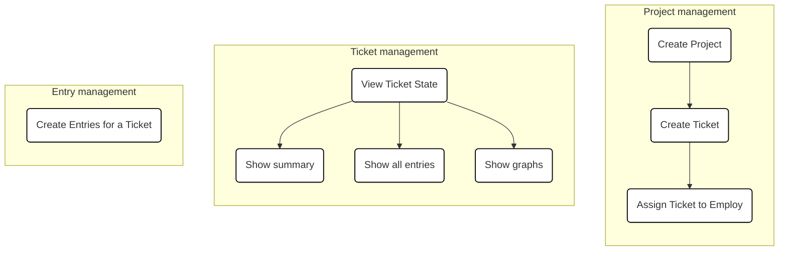
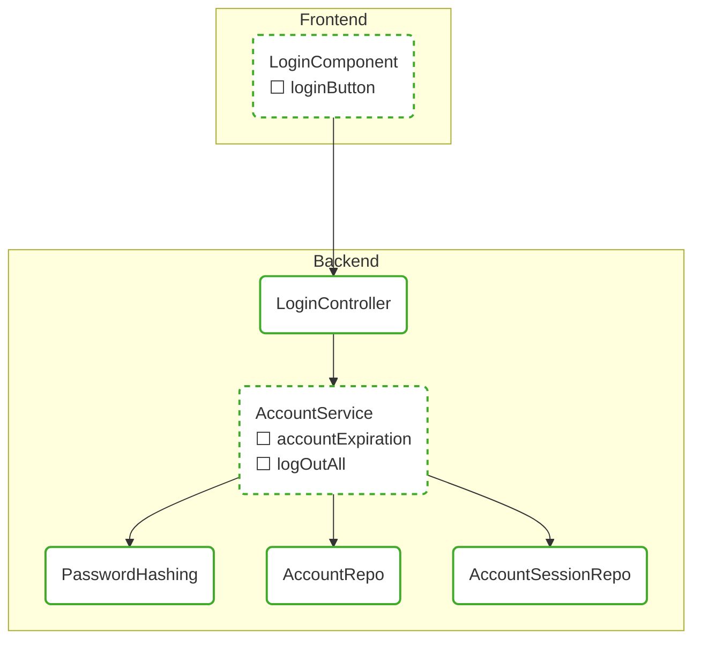

# Plan

```mermaid

flowchart TB
    classDef default fill:#fff,stroke:#000,stroke-width:1.5px;

    classDef in-prog stroke:#41aa2a, stroke-dasharray: 5 5, stroke-width: 2px

    classDef done stroke:#41aa2a, stroke-width: 2px

    subgraph "Project management"
        direction TB

        cp(Create Project)
        ct(Create Ticket)
        ate(Assign Ticket to Employ)

        cp --> ct --> ate
    end


    subgraph "Ticket management"
        direction TB
        vts(View Ticket State)
        ss(Show summary)
        sae(Show all entries)
        sg(Show graphs)

        vts --> ss
        vts --> sae
        vts --> sg
    end

    subgraph "Entry management"
        direction TB

        cefat(Create Entries for a Ticket)

    end


```

## Login

```mermaid

flowchart TB
    classDef default fill:#fff,stroke:#000,stroke-width:1.5px;

    classDef in-prog stroke:#41aa2a, stroke-dasharray: 5 5, stroke-width: 2px, text-align:left

    classDef not-done stroke:#bcbcbc, stroke-dasharray: 5 5, stroke-width: 2px, text-align: left

    classDef done stroke:#41aa2a, stroke-width: 2px, text-align: left

    subgraph "Frontend"
        direction TB
        lcomp("LoginComponent
        ⬜ loginButton
        "):::in-prog

    end

    subgraph "Backend"
        direction TB

        lc(LoginController):::done
        ac("AccountService
        ⬜ accountExpiration
        ⬜ logOutAll
        "):::in-prog
        ph(PasswordHashing):::done
        acrep(AccountRepo):::done
        accsesrepo(AccountSessionRepo):::done

        ac --> ph
        ac --> acrep
        ac --> accsesrepo
        lc --> ac
    end

        lcomp ---> lc


```